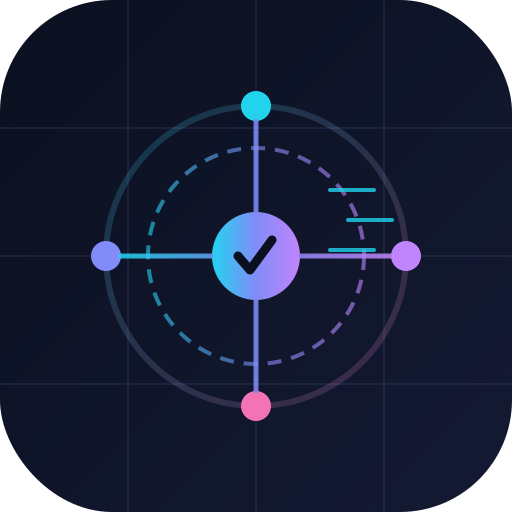

<div align="center">



# zt-harvester

**Pembuat akun ZeroTwo massal · harvester session / token / cookie · koneksi otomatis 9Router**

[](https://python.org)
[](LICENSE)
[](https://9router.com)
[](#)
[](https://app.zerotwo.ai)
[](#)

*Buat akun ZeroTwo secara massal, ambil sesi JWT, cookie dan token CSRF-nya, lalu hubungkan setiap akun ke [9Router](https://9router.com) sebagai provider yang kompatibel dengan OpenAI — dari awal sampai akhir.*

[English](../README.md) · [Bahasa Indonesia](README.id.md) · [Español](README.es.md) · [日本語](README.ja.md) · [中文](README.zh.md) · [Français](README.fr.md)

</div>

---

## Apa yang dilakukannya

1. **Membuat** N akun ZeroTwo secara otomatis, masing-masing dengan email sekali pakai dari penyedia kompatibel mail.tm.
2. **Memverifikasi** tautan ajaib (magic link) dan menyelesaikan wizard onboarding (nama, minat).
3. **Mengambil** JWT Supabase `access_token`, `refresh_token`, seluruh cookie (termasuk `cf_clearance` / `__csrf`), token CSRF, profil akun, dan katalog model lengkap.
4. **Menghubungkan** setiap sesi hasil panen ke **9Router** sebagai koneksi provider yang kompatibel dengan OpenAI, sehingga semua akun dapat diakses lewat satu endpoint `/v1`.
5. **Menjembatani** perbedaan protokol dengan shim bawaan yang kompatibel dengan OpenAI, karena API ZeroTwo sendiri tidak berbentuk OpenAI.

## Arsitektur

```
                 +-------------------+        magic link         +------------------+
   create -----> |  mail.tm mailbox  | <------------------------ |                  |
                 +-------------------+                           |                  |
                                                               |   ZeroTwo web /  |
                 +-------------------+     CDP automation        |   API endpoints  |
   drive  ----> |  Chromium (CDP)   | ------------------------> |                  |
                 +-------------------+                           +------------------+
                                                                         |
                              harvest JWT + cookies + csrf               |
                 +-------------------+ <---------------------------------+
                 |     Harvester     |
                 +---------+---------+
                           |
              +------------+-------------+
              |                          |
      +-------v-------+         +--------v---------+
      |  sessions.jsonl|         |  OpenAI shim     |
      +---------------+         |  (port 8787)     |
                                +--------+---------+
                                         |
                                +--------v---------+
                                |     9Router      |
                                |   :20128 /v1     |
                                +------------------+
```

## Instalasi

```bash
git clone https://github.com/0xgetz/zt-harvester.git
cd zt-harvester
pip install -e ".[shim]"
```

## Mulai Cepat

**1. Jalankan shim yang kompatibel dengan OpenAI** (menjembatani ZeroTwo → format OpenAI):

```bash
export ZT_ZT_COOKIES="cf_clearance=...; __csrf=..."
export ZT_ZT_CSRF="<token from sessionStorage: zerotwo.csrf.token.v1>"
zt-harvester shim --port 8787
```

**2. Jalankan browser dengan remote debugging** (atau gunakan endpoint CDP cloud):

```bash
google-chrome --remote-debugging-port=9222 --user-data-dir=./chrome-data
```

**3. Buat dan hubungkan akun:**

```bash
zt-harvester run \
  --count 5 \
  --cdp-ws "ws://127.0.0.1:9222/devtools/browser/<id>" \
  --router-url "http://localhost:20128" \
  --shim-base-url "http://localhost:8787/v1"
```

Setiap akun tersimpan di `harvest/sessions.jsonl` dan di dasbor 9Router.

## CLI

| Perintah|Fungsi | |
| --- | --- |
| `zt-harvester run -n 5` | Buat + panen + hubungkan N akun |
| `zt-harvester shim -p 8787` | Jalankan shim ZeroTwo kompatibel OpenAI |
| `zt-harvester export -f csv` | Ekspor ledger panen |

## API Python

```python
import asyncio
from ztharvester import Harvester, HarvesterConfig

cfg = HarvesterConfig.from_env()
cfg.browser.cdp_ws = "ws://127.0.0.1:9222/devtools/browser/<id>"
cfg.router.shim_base_url = "http://localhost:8787/v1"
asyncio.run(Harvester(cfg).run(count=10))
```

## Konfigurasi

Salin `config.example.toml` dan `.env.example`:

```bash
cp config.example.toml config.toml
cp .env.example .env
zt-harvester run -n 3 --config config.toml
```

Semua kolom terdokumentasi langsung di dalam `config.example.toml`.

## Pengujian

```bash
pip install -e ".[dev]"
pytest -q
```

## Struktur proyek

```
src/ztharvester/
  mail.py      Klien email sekali pakai kompatibel mail.tm
  zerotwo.py   Driver pendaftaran / magic-link / onboarding + harvester
  cdp.py       Adapter CDP (websocket lokal, bridge dalam proses, cloud)
  router9.py   Klien API manajemen provider 9Router
  shim.py      Jembatan protokol OpenAI-kompatibel <-> ZeroTwo
  engine.py    Orkestrasi konkuren + ledger JSONL yang dapat dilanjutkan
  config.py    Model konfigurasi
  cli.py       Antarmuka baris perintah
tests/
docs/          6 translated READMEs
assets/        logo
```

## Kebutuhan

- Python 3.10+
- Chromium yang dapat diakses via CDP (port debug lokal atau browser cloud)
- Instance [9Router](https://9router.com) yang berjalan (default `http://localhost:20128`)

## Catatan

- Edge ZeroTwo memerlukan cookie `cf_clearance` dan token CSRF selain JWT; ekspor keduanya ke shim sekali saja.
- Shim menjalankan satu proses yang melayani setiap akun hasil panen — JWT dibaca per permintaan dari `Authorization`.
- Gunakan secara bertanggung jawab dan hanya pada akun yang sah Anda buat.

## License

MIT — lihat [LICENSE](LICENSE).

<div align="center"><sub>Dibuat untuk ekosistem 9Router · tidak berafiliasi dengan ZeroTwo atau 9Router</sub></div>
